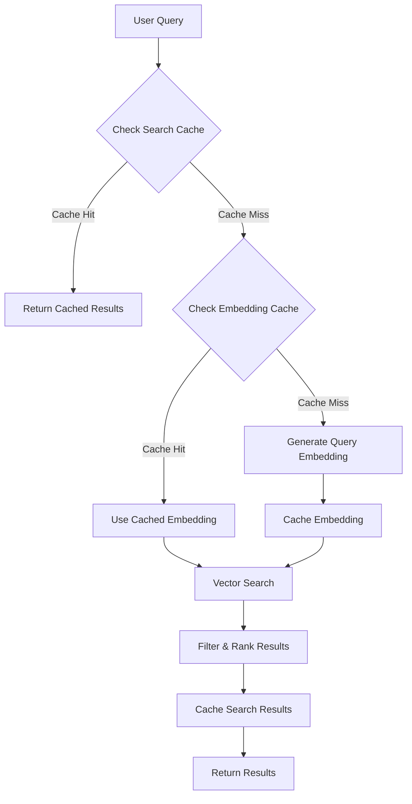

# Semantic Search Implementation

## Overview

The semantic search functionality enables users to find relevant Q&A content using natural language queries. It leverages Google Gemini's embedding model to convert text into vector representations and uses Convex's vector search capabilities to find semantically similar content.

## Architecture

### Components

1. **performSemanticSearch Action** (`convex/actions.ts`)
   - Main entry point for semantic search
   - Handles query embedding generation
   - Manages caching at multiple levels
   - Performs vector similarity search
   - Applies relevance filtering and ranking

2. **semantic Query** (`convex/search.ts`)
   - Executes vector search using Convex vector indexes
   - Supports category filtering
   - Returns results with similarity scores

3. **Embedding Cache** (`convex/embeddings.ts`)
   - Caches query embeddings to reduce API calls
   - Tracks access patterns for optimization
   - Supports TTL-based expiration

4. **Search Cache** (`convex/search.ts`)
   - Caches complete search results
   - 5-minute TTL by default
   - Includes query hash, results, and scores

## Usage

### Basic Search

```typescript
import { api } from "@/convex/_generated/api";
import { useAction } from "convex/react";

function SearchComponent() {
  const performSearch = useAction(api.actions.performSemanticSearch);
  
  const handleSearch = async (query: string) => {
    const results = await performSearch({
      query,
      limit: 10,
      locale: "en",
    });
    
    console.log(`Found ${results.totalResults} results`);
    console.log(`From cache: ${results.fromCache}`);
    
    results.results.forEach(result => {
      console.log(`${result.question} (score: ${result.score})`);
    });
  };
}
```

### Search with Filters

```typescript
const results = await performSearch({
  query: "carbon emissions reduction",
  limit: 20,
  category: "Carbon Markets",
  minScore: 0.7,
  locale: "en",
});
```

### Search Parameters

| Parameter | Type | Default | Description |
|-----------|------|---------|-------------|
| `query` | string | required | The search query text |
| `limit` | number | 10 | Maximum number of results (1-50) |
| `category` | string | undefined | Filter by category |
| `section` | string | undefined | Filter by section |
| `locale` | string | "vi" | Language locale for caching |
| `minScore` | number | 0.5 | Minimum relevance score (0-1) |
| `useCache` | boolean | true | Enable/disable caching |

### Response Format

```typescript
{
  results: [
    {
      id: Id<"questions">,
      question: string,
      answer: string,
      category: string,
      sources: Array<{type, title, url, location}>,
      tags: string[],
      isCommon: boolean,
      sequence: number,
      score: number, // Relevance score (0-1)
    }
  ],
  query: string,
  totalResults: number,
  fromCache: boolean,
  filters: {
    category?: string,
    section?: string,
    locale: string,
  }
}
```

## How It Works

### 1. Query Processing



### 2. Embedding Generation

- **Task Type**: `RETRIEVAL_QUERY` for search queries
- **Model**: `gemini-embedding-001`
- **Dimensions**: 768
- **Caching**: Query embeddings are cached with a 7-day TTL

### 3. Vector Search

- Uses Convex's `vectorSearch` API
- Searches the `byEmbedding` vector index on the `questions` table
- Supports filtering by category
- Returns similarity scores (0-1 range)

### 4. Relevance Ranking

Results are ranked by:
1. **Similarity Score**: Cosine similarity between query and document embeddings
2. **Minimum Threshold**: Default 0.5, configurable per query
3. **Sorting**: Descending by score

### 5. Caching Strategy

Three-layer caching system:

1. **Search Cache** (5 minutes)
   - Caches complete search results
   - Key: Hash of query + filters + locale
   - Includes question IDs and scores

2. **Embedding Cache** (7 days)
   - Caches query embeddings
   - Key: `query::{normalized_query}`
   - Tracks access count and last access time

3. **Client Cache** (TanStack Query)
   - Handled by the frontend
   - Configurable stale time and cache time

## Performance Optimization

### Embedding Cache Benefits

- **Reduced API Calls**: Common queries reuse cached embeddings
- **Faster Response**: No API latency for cached queries
- **Cost Savings**: Fewer Gemini API requests

### Search Cache Benefits

- **Sub-200ms Response**: Cached results return instantly
- **Reduced Database Load**: No vector search for cached queries
- **Better UX**: Consistent fast responses for popular queries

### Best Practices

1. **Set Appropriate Limits**: Use smaller limits (5-10) for better performance
2. **Use Minimum Scores**: Filter out low-relevance results (0.6-0.7 threshold)
3. **Enable Caching**: Keep `useCache: true` for production
4. **Prefetch Common Queries**: Pre-generate embeddings for popular terms

## Testing

Run the test script to verify functionality:

```bash
node scripts/testSemanticSearch.mjs
```

The test script verifies:
- Basic semantic search
- Cache hit behavior
- Category filtering
- Score thresholds
- Multi-language support

## Monitoring

### Key Metrics

1. **Cache Hit Rate**: Target >70% for search cache
2. **Average Response Time**: Target <500ms (uncached), <200ms (cached)
3. **Relevance Score Distribution**: Monitor average scores
4. **API Usage**: Track Gemini API calls for cost management

### Logging

The implementation includes detailed logging:
- Cache hits/misses
- Embedding generation
- Search result counts
- Performance timings

## Error Handling

### Common Errors

1. **Empty Query**: Returns error immediately
2. **API Rate Limit**: Handled by GeminiHelper with retry logic
3. **No Results**: Returns empty array with appropriate message
4. **Invalid Filters**: Ignored, search proceeds without filter

### Retry Logic

- Automatic retry for transient API failures
- Exponential backoff (1s, 2s, 4s)
- Maximum 3 retries
- Non-retryable errors fail immediately

## Future Enhancements

1. **Hybrid Search**: Combine vector search with keyword search
2. **Query Expansion**: Automatically expand queries with synonyms
3. **Personalization**: Rank results based on user preferences
4. **Analytics**: Track search patterns and popular queries
5. **A/B Testing**: Test different relevance thresholds
6. **Multi-vector Search**: Use multiple embedding models

## Related Documentation

- [Convex Vector Search](https://docs.convex.dev/vector-search)
- [Google Gemini Embeddings](https://ai.google.dev/docs/embeddings_guide)
- [Caching Strategy](./caching-strategy.md)
- [Performance Optimization](./performance.md)
