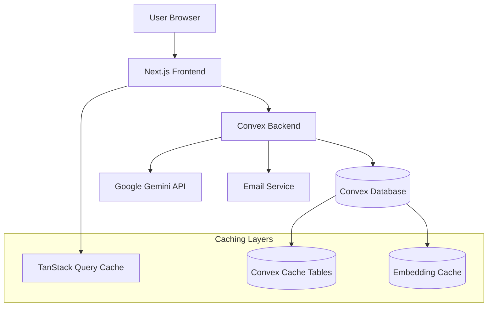

# Design Document

## Overview

The Carbon Knowledge Platform is designed as a modern, scalable web application that provides semantic search and AI-powered assistance for carbon market information. The architecture leverages Next.js for the frontend, Convex for backend services and database, and Google Gemini for AI capabilities. The system implements a multi-layer caching strategy to ensure optimal performance while managing API costs.

## Architecture

### High-Level Architecture



### Technology Stack

- **Frontend**: Next.js 15+ with App Router, TypeScript, Tailwind CSS
- **Backend**: Convex (serverless functions, database, vector search)
- **AI/ML**: Google Gemini (gemini-embedding-001, gemini-2.0-flash-exp)
- **Caching**: TanStack Query (client), Convex tables (server)
- **Internationalization**: next-intl (Vietnamese/English)
- **Email**: Resend for notifications

## Components and Interfaces

### Frontend Components

#### 1. Landing Page (`app/page.tsx`)
- **Hero Section**: Value proposition and platform introduction
- **SearchBar Component**: Dual-action search interface
- **Features Overview**: Platform capabilities summary
- **Recent Q&As Preview**: Sample content display
- **Feedback Form**: User feedback collection

#### 2. SearchBar Component (`components/SearchBar.tsx`)
```typescript
interface SearchBarProps {
  initialQuery?: string;
  onSearch?: (query: string) => void;
  onAskAI?: (query: string) => void;
}

// Features:
// - Input field with placeholder text
// - Two action buttons: "Search" and "Ask AI"
// - Keyboard navigation (Enter key)
// - Query validation and trimming
```

#### 3. Search Results Page (`app/search/page.tsx`)
- **Search Interface**: Persistent search bar
- **Results Display**: Grid of QuestionCard components
- **Loading States**: Skeleton loading indicators
- **Error Handling**: User-friendly error messages
- **Pagination**: Results pagination (future enhancement)

#### 4. QuestionCard Component (`components/QuestionCard.tsx`)
```typescript
interface QuestionCardProps {
  question: string;
  answer: string;
  source: string;
  score?: number;
  category?: string;
  tags?: string[];
}

// Features:
// - Expandable answer content
// - Source attribution
// - Relevance score display
// - Category and tag indicators
```

### Backend Architecture

#### 1. Database Schema (`convex/schema.ts`)

**Questions Table**
- Primary content storage with vector embeddings
- Full-text search index on question field
- Vector index for semantic similarity search
- Category-based filtering support

**Cache Tables**
- `embeddingCache`: Stores generated embeddings with access tracking
- `searchCache`: Caches search results with TTL
- `aiResponseCache`: Caches AI responses (future phase)

**Analytics Table**
- Event tracking for search queries
- Performance metrics collection
- Cache hit rate monitoring

#### 2. API Layer (`convex/`)

**Queries (`queries.ts`)**
- `getQuestions`: Retrieve Q&A content
- `getCachedEmbedding`: Check embedding cache
- `getCachedSearchResults`: Check search result cache
- `getAnalytics`: Performance metrics

**Mutations (`mutations.ts`)**
- `importQuestion`: Add new Q&A with embedding
- `cacheEmbedding`: Store embedding in cache
- `cacheSearchResults`: Store search results
- `clearExpiredCaches`: Cleanup expired cache entries

**Actions (`actions.ts`)**
- `generateEmbedding`: Call Gemini API for embeddings
- `performSemanticSearch`: Execute vector search with caching
- `batchGenerateEmbeddings`: Bulk embedding generation

#### 3. Gemini Integration (`convex/lib/gemini.ts`)

```typescript
class GeminiHelper {
  // Embedding generation with task type specification
  generateEmbedding(text: string, taskType: "RETRIEVAL_DOCUMENT" | "RETRIEVAL_QUERY")
  
  // Response generation for AI chat (future phase)
  generateResponse(prompt: string, context: string)
  
  // Rate limiting and error handling
  // Retry logic for API failures
  // Cost optimization strategies
}

RETRIEVAL_DOCUMENT, RETRIEVAL_QUERY, QUESTION_ANSWERING, and FACT_VERIFICATION: Used to generate embeddings that are optimized for document search or information retrieval.
```

## Data Models

### Core Data Structures

#### Question Model
```typescript
interface Question {
  _id: Id<"questions">;
  question: string;
  answer: string;
  source: string;
  embedding: number[]; // 768-dimensional vector
  category?: string;
  tags?: string[];
  createdAt: number;
  updatedAt: number;
}
```

#### Embedding Cache Model
```typescript
interface EmbeddingCache {
  _id: Id<"embeddingCache">;
  text: string;
  embedding: number[];
  taskType: "RETRIEVAL_DOCUMENT" | "RETRIEVAL_QUERY";
  createdAt: number;
  lastAccessedAt: number;
  accessCount: number;
}
```

#### Search Cache Model
```typescript
interface SearchCache {
  _id: Id<"searchCache">;
  queryHash: string;
  queryText: string;
  results: Id<"questions">[];
  scores: number[];
  createdAt: number;
  expiresAt: number;
}
```

### Data Flow

1. **Content Import Flow**
   - Read Q&A from JSON files
   - Generate embeddings using Gemini (RETRIEVAL_DOCUMENT)
   - Store in questions table with vector index
   - Cache embeddings for reuse

2. **Search Flow**
   - User submits query
   - Check search cache (5-minute TTL)
   - If cache miss: generate query embedding (RETRIEVAL_QUERY)
   - Perform vector similarity search
   - Cache results and return to user

3. **Caching Strategy**
   - **Layer 1**: TanStack Query (client-side, 5-10 minutes)
   - **Layer 2**: Convex cache tables (server-side, 5-30 minutes)
   - **Layer 3**: Persistent embedding cache (access-based cleanup)

## Error Handling

### Client-Side Error Handling
- Network failure recovery with retry logic
- Graceful degradation for offline scenarios
- User-friendly error messages
- Loading state management

### Server-Side Error Handling
- Gemini API rate limit handling
- Database connection error recovery
- Cache invalidation on errors
- Structured error logging

### Error Recovery Strategies
- Automatic retry with exponential backoff
- Fallback to cached results when possible
- Circuit breaker pattern for external APIs
- Health check endpoints for monitoring

## Testing Strategy

### Unit Testing
- Component testing with React Testing Library
- Convex function testing with test environment
- Gemini integration mocking for consistent tests
- Cache logic validation

### Integration Testing
- End-to-end search flow testing
- Database migration validation
- API integration testing
- Performance benchmarking

### Performance Testing
- Load testing for concurrent users
- Cache hit rate optimization
- API response time monitoring
- Memory usage profiling

### Test Data Management
- Sample Q&A dataset for testing
- Mock embedding vectors for development
- Automated test data cleanup
- Staging environment with production-like data

## Performance Optimization

### Caching Strategy
- **Embedding Cache**: Persistent storage with LRU eviction
- **Search Cache**: Time-based expiration (5 minutes)
- **Client Cache**: TanStack Query with stale-while-revalidate
- **Prefetching**: Common queries preloaded

### Database Optimization
- Vector index optimization for similarity search
- Compound indexes for filtered queries
- Query result pagination
- Connection pooling and reuse

### API Optimization
- Batch embedding generation during migration
- Rate limiting to prevent quota exhaustion
- Response compression
- CDN integration for static assets

### Monitoring and Metrics
- Cache hit rate tracking (target: >70%)
- API response time monitoring
- Database query performance
- User engagement analytics

## Security Considerations

### API Security
- Environment variable protection
- API key rotation strategy
- Rate limiting per user/IP
- Input validation and sanitization

### Data Protection
- No PII storage in embeddings
- Secure data transmission (HTTPS)
- Database access controls
- Audit logging for admin actions

### Content Security
- XSS prevention in user-generated content
- Content validation before embedding generation
- Source attribution and verification
- Spam detection for user submissions

## Deployment Architecture

### Development Environment
- Local Convex development deployment
- Environment variable management
- Hot reloading for rapid development
- Mock services for external APIs

### Production Environment
- Convex cloud deployment
- Environment-specific configurations
- Monitoring and alerting setup
- Backup and disaster recovery

### CI/CD Pipeline
- Automated testing on pull requests
- Database migration validation
- Performance regression testing
- Staged deployment process